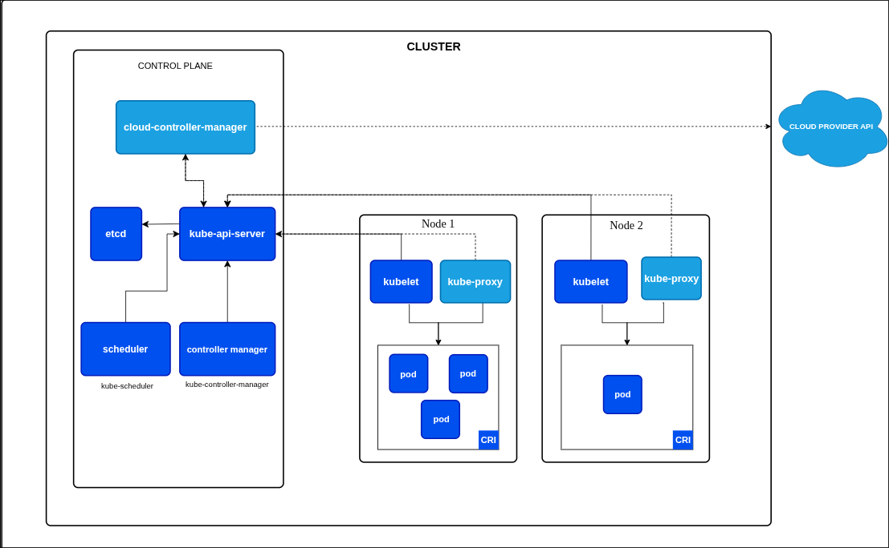

# K8S Practice Lab

A hands-on repo for leveling up Kubernetes skills through practical exercises. Each exercise targets a specific concept, from cluster fundamentals to real-world deployment patterns.

## Cluster Architecture

## Exercises

> Exercises will be added here progressively.

| # | Topic | Description |
|---|-------|-------------|
|   |       |             |

## Resources

- [kubernetes-info.md](kubernetes-info.md) — Core Kubernetes concepts and component reference
